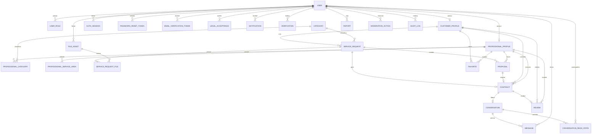

# Modelo de Dados da Soravi

## 1. Objetivo

Este documento define o modelo de dados oficial do MVP da Soravi.

O modelo deve representar com segurança e consistência:

- usuários;
- perfis de cliente e profissional;
- categorias de serviço;
- áreas de atendimento;
- solicitações;
- propostas;
- contratações;
- conversas;
- mensagens;
- avaliações;
- favoritos;
- notificações;
- autenticação e sessões;
- arquivos;
- verificações;
- denúncias;
- moderação;
- auditoria.

O PostgreSQL será a fonte oficial dos dados permanentes da plataforma.

Este documento representa o modelo conceitual e as regras de integridade. O `schema.prisma` será implementado posteriormente, de forma incremental e alinhada às funcionalidades desenvolvidas.

---

## 2. Princípios de modelagem

O modelo de dados deverá respeitar os seguintes princípios:

1. Um usuário poderá atuar como cliente e profissional.
2. A identidade do usuário será separada de seus perfis.
3. As regras críticas serão protegidas pelo backend e por restrições no banco.
4. Estados de negócio não poderão ser alterados livremente.
5. Valores monetários serão armazenados em centavos.
6. Datas serão armazenadas em UTC.
7. Dados pessoais serão coletados somente quando necessários.
8. Exclusões sensíveis utilizarão exclusão lógica ou anonimização.
9. Arquivos não serão armazenados diretamente no PostgreSQL.
10. Redis não será utilizado como fonte permanente de dados.
11. Relações importantes possuirão índices e restrições únicas.
12. Alterações de schema serão realizadas por migrations versionadas.
13. O histórico necessário para segurança e suporte deverá ser preservado.
14. Dados derivados não substituirão suas fontes oficiais.
15. O modelo não deverá antecipar funcionalidades fora do MVP.

---

## 3. Visão geral



---

## 4. Convenções globais

### 4.1 Identificadores

Todas as entidades principais utilizarão identificadores UUID.

Exemplo conceitual:

```text
id: UUID
```

A configuração definitiva será aplicada no Prisma.

### 4.2 Datas

Entidades persistentes deverão possuir, quando aplicável:

```text
createdAt
updatedAt
deletedAt
```

Todas as datas serão armazenadas em UTC.

A conversão para o horário local será responsabilidade da camada de apresentação.

### 4.3 Exclusão lógica

Entidades que possuam histórico, relacionamento ou impacto operacional não deverão ser removidas imediatamente.

O campo:

```text
deletedAt
```

será utilizado para exclusão lógica quando necessário.

A exclusão lógica não substitui políticas de anonimização e retenção de dados.

### 4.4 Valores monetários

Valores serão armazenados como números inteiros em centavos.

Exemplo:

```text
R$ 150,00 = 15000
```

Não deverão ser utilizados números de ponto flutuante para valores financeiros.

### 4.5 Enums

Enums serão escritos em inglês no código e apresentados em português na interface.

Exemplo:

```text
OPEN → Aberta
COMPLETED → Concluída
```

### 4.6 Normalização

E-mails e telefones poderão possuir campos normalizados para busca e unicidade.

Exemplos:

```text
emailNormalized
phoneNormalized
```

### 4.7 Dados derivados

Campos derivados poderão ser armazenados para melhorar consultas, desde que sua fonte oficial permaneça identificada.

Exemplos:

```text
ProfessionalProfile.averageRating
ProfessionalProfile.reviewCount
ProfessionalProfile.servicesCompletedCount
```

As fontes oficiais desses dados serão `Review` e `Contract`.

---

## 5. Usuários e identidade

## 5.1 User

Representa a identidade principal de uma pessoa na Soravi.

### Campos

```text
id
name
email
emailNormalized
passwordHash
phone
phoneNormalized
avatarFileId
status
emailVerifiedAt
phoneVerifiedAt
lastLoginAt
createdAt
updatedAt
deletedAt
```

### Status

```text
PENDING
ACTIVE
SUSPENDED
BLOCKED
DEACTIVATED
```

### Regras

- O e-mail normalizado deverá ser único.
- O telefone normalizado poderá ser único quando informado.
- A senha nunca será armazenada em texto puro.
- O usuário poderá possuir perfil de cliente e profissional.
- Um usuário poderá possuir mais de um papel.
- Usuários suspensos ou bloqueados não poderão executar ações comuns.
- A exclusão da conta deverá considerar retenção e anonimização.
- Campos privados não deverão aparecer em perfis públicos.
- E-mail e telefone deverão ser tratados como dados pessoais.
- O campo `avatarFileId` deverá apontar para um arquivo autorizado.

### Restrições

```text
emailNormalized UNIQUE
phoneNormalized UNIQUE, quando informado e aplicável
```

---

## 5.2 UserRole

Representa os papéis que um usuário possui na plataforma.

### Campos

```text
id
userId
role
createdAt
```

### Papéis

```text
CUSTOMER
PROFESSIONAL
MODERATOR
ADMIN
```

### Regras

- Um usuário poderá possuir mais de um papel.
- Papéis administrativos não poderão ser atribuídos por usuários comuns.
- A criação e remoção de papéis administrativos deverá ser auditada.
- Ter o papel não substitui a necessidade do perfil correspondente.

### Restrição única

```text
userId + role UNIQUE
```

---

## 5.3 CustomerProfile

Representa os dados específicos de um cliente.

### Campos

```text
id
userId
createdAt
updatedAt
```

### Regras

- Cada usuário poderá possuir no máximo um perfil de cliente.
- O relacionamento com `User` será um para um.
- O perfil poderá ser criado quando o usuário ativar a função de cliente.
- O perfil será usado como proprietário das solicitações, contratos, avaliações e favoritos.

### Restrição

```text
userId UNIQUE
```

---

## 5.4 ProfessionalProfile

Representa os dados profissionais de um prestador de serviço.

### Campos

```text
id
userId
displayName
bio
verificationStatus
averageRating
reviewCount
servicesCompletedCount
isAvailable
createdAt
updatedAt
deletedAt
```

### Status de verificação

```text
NOT_STARTED
PENDING
APPROVED
REJECTED
```

### Regras

- Cada usuário poderá possuir no máximo um perfil profissional.
- A descrição deverá possuir limite de caracteres.
- O nome de exibição poderá ser diferente do nome civil.
- A nota média terá como fonte oficial as avaliações.
- `averageRating`, `reviewCount` e `servicesCompletedCount` serão dados derivados.
- O profissional poderá controlar sua disponibilidade.
- Um profissional bloqueado ou reprovado poderá ter sua visibilidade limitada.
- Dados públicos e privados deverão ser separados nas respostas da API.
- A verificação básica não representará garantia da qualidade do serviço.

### Restrição

```text
userId UNIQUE
```

---

## 5.5 LegalAcceptance

Representa o aceite de termos, políticas e documentos legais.

### Campos

```text
id
userId
documentType
documentVersion
acceptedAt
ipAddress
userAgent
createdAt
```

### Tipos iniciais

```text
TERMS_OF_USE
PRIVACY_POLICY
COMMUNICATION_CONSENT
```

### Regras

- O aceite deverá registrar a versão do documento.
- Novas versões poderão exigir novo aceite.
- O registro não deverá ser alterado por usuários comuns.
- IP e agente do usuário somente serão armazenados quando necessários.
- A retirada de consentimento deverá seguir a finalidade e a base legal aplicável.

### Restrição recomendada

```text
userId + documentType + documentVersion UNIQUE
```

---

## 6. Categorias e área de atendimento

## 6.1 Category

Representa uma categoria de serviço.

### Campos

```text
id
name
slug
description
icon
status
parentId
createdAt
updatedAt
deletedAt
```

### Status

```text
ACTIVE
INACTIVE
```

### Regras

- O `slug` deverá ser único.
- Categorias inativas não poderão ser usadas em novas solicitações.
- Categorias inativas poderão continuar aparecendo em históricos.
- `parentId` permitirá categorias hierárquicas no futuro.
- A remoção de categoria utilizada deverá ser lógica.
- Alterações administrativas deverão ser auditadas.

### Restrições

```text
slug UNIQUE
parentId referencia Category.id
```

---

## 6.2 ProfessionalCategory

Relaciona profissionais às categorias atendidas.

### Campos

```text
id
professionalProfileId
categoryId
createdAt
```

### Regras

- Um profissional poderá atender várias categorias.
- A categoria deverá estar ativa para novas associações.
- A associação não deverá ser duplicada.

### Restrição única

```text
professionalProfileId + categoryId UNIQUE
```

---

## 6.3 ProfessionalServiceArea

Representa as regiões atendidas por um profissional.

### Campos

```text
id
professionalProfileId
country
state
city
createdAt
```

### Regras do MVP

- O país padrão será Brasil.
- Estado e cidade serão utilizados para compatibilidade inicial.
- Um profissional poderá atender várias cidades.
- Geolocalização avançada e cálculo por raio ficam fora do MVP.
- Estado deverá utilizar uma representação padronizada.
- Cidade deverá ser normalizada antes da gravação.

### Restrição única

```text
professionalProfileId + country + state + city UNIQUE
```

---

## 7. Solicitações de serviço

## 7.1 ServiceRequest

Representa uma necessidade publicada por um cliente.

### Campos

```text
id
customerProfileId
categoryId
title
description
status
country
state
city
neighborhood
postalCode
addressLine
addressNumber
addressComplement
publishedAt
hiredAt
startedAt
completedAt
cancelledAt
cancellationReason
createdAt
updatedAt
deletedAt
```

### Status

```text
DRAFT
OPEN
RECEIVING_PROPOSALS
IN_NEGOTIATION
HIRED
IN_PROGRESS
COMPLETED
CANCELLED
```

### Regras

- A solicitação pertence a um único cliente.
- Somente o proprietário poderá editar, publicar ou cancelar.
- A categoria deverá estar ativa no momento da publicação.
- O endereço completo não deverá ser exposto publicamente.
- Antes da contratação, profissionais verão somente localização aproximada.
- Solicitações contratadas ou concluídas não poderão ser editadas livremente.
- A exclusão deverá preservar o histórico necessário.
- Fotos serão relacionadas por meio de `ServiceRequestFile`.
- Uma solicitação poderá receber várias propostas.
- Uma solicitação poderá gerar no máximo uma contratação.
- A data de cada estado relevante deverá ser registrada.
- O motivo de cancelamento poderá ser obrigatório conforme o estado atual.

### Significado dos estados

#### DRAFT

A solicitação foi criada, mas ainda não foi publicada.

#### OPEN

A solicitação foi publicada e ainda não recebeu proposta ativa.

#### RECEIVING_PROPOSALS

A solicitação está publicada e possui pelo menos uma proposta ativa.

#### IN_NEGOTIATION

O cliente está analisando ou comparando propostas.

No MVP, essa negociação não libera o chat.

#### HIRED

Uma proposta foi aceita e uma contratação foi criada.

#### IN_PROGRESS

O serviço foi iniciado.

#### COMPLETED

O serviço foi concluído.

#### CANCELLED

A solicitação foi cancelada.

---

## 7.2 Transições da solicitação

Transições permitidas:

```text
DRAFT → OPEN
DRAFT → CANCELLED

OPEN → RECEIVING_PROPOSALS
OPEN → CANCELLED

RECEIVING_PROPOSALS → IN_NEGOTIATION
RECEIVING_PROPOSALS → HIRED
RECEIVING_PROPOSALS → CANCELLED

IN_NEGOTIATION → RECEIVING_PROPOSALS
IN_NEGOTIATION → HIRED
IN_NEGOTIATION → CANCELLED

HIRED → IN_PROGRESS
HIRED → CANCELLED

IN_PROGRESS → COMPLETED
IN_PROGRESS → CANCELLED
```

### Regras

- Uma solicitação concluída não poderá retornar para estados anteriores.
- Uma solicitação cancelada não poderá receber novas propostas.
- O aceite de uma proposta deverá alterar a solicitação para `HIRED`.
- O início da contratação deverá alterar a solicitação para `IN_PROGRESS`.
- A conclusão da contratação deverá alterar a solicitação para `COMPLETED`.
- As transições serão executadas por ações específicas do backend.
- Endpoints genéricos não poderão aceitar qualquer valor de status.

---

## 7.3 FileAsset

Representa os metadados de um arquivo armazenado na nuvem.

### Campos

```text
id
ownerUserId
storageProvider
storageBucket
storageKey
originalName
mimeType
sizeInBytes
checksum
status
createdAt
updatedAt
deletedAt
```

### Status

```text
PENDING
PROCESSING
READY
BLOCKED
FAILED
DELETED
```

### Regras

- O arquivo físico ficará no armazenamento em nuvem.
- O PostgreSQL armazenará somente os metadados.
- O nome interno será gerado pelo sistema.
- Tipo, conteúdo e tamanho deverão ser validados.
- Arquivos executáveis não serão permitidos.
- Arquivos bloqueados não poderão ser exibidos.
- O proprietário deverá ser identificado.
- O arquivo não poderá ser vinculado a recursos de outro usuário sem autorização.
- A exclusão do registro deverá coordenar a remoção do arquivo físico.
- Metadados sensíveis de imagens poderão ser removidos.

---

## 7.4 ServiceRequestFile

Relaciona arquivos às solicitações.

### Campos

```text
id
serviceRequestId
fileAssetId
position
createdAt
```

### Regras

- O arquivo deverá pertencer ao cliente proprietário da solicitação.
- Somente arquivos com status `READY` poderão ser exibidos.
- A quantidade máxima de imagens será definida nas regras de negócio.
- A posição será utilizada para ordenar as imagens.

### Restrições

```text
serviceRequestId + fileAssetId UNIQUE
serviceRequestId + position UNIQUE
```

---

## 8. Propostas

## 8.1 Proposal

Representa uma proposta enviada por um profissional.

### Campos

```text
id
serviceRequestId
professionalProfileId
amountInCents
estimatedDurationValue
estimatedDurationUnit
message
status
submittedAt
acceptedAt
rejectedAt
withdrawnAt
expiredAt
createdAt
updatedAt
```

### Unidades de prazo

```text
HOUR
DAY
WEEK
MONTH
```

### Status

```text
ACTIVE
ACCEPTED
REJECTED
WITHDRAWN
EXPIRED
```

### Regras

- Um profissional poderá possuir somente uma proposta por solicitação.
- A proposta poderá ser editada enquanto estiver ativa.
- A solicitação deverá aceitar propostas no momento do envio.
- O profissional deverá atender à categoria da solicitação.
- O profissional não poderá enviar proposta para sua própria solicitação.
- Somente o profissional proprietário poderá editar ou retirar a proposta.
- Somente o cliente proprietário da solicitação poderá aceitar a proposta.
- O valor deverá ser maior que zero.
- Prazo e unidade deverão ser coerentes.
- Após o aceite, nenhuma nova proposta poderá ser enviada.
- As demais propostas ativas deverão ser rejeitadas.
- Valor, prazo e mensagem aceitos serão preservados na contratação.
- Propostas retiradas ou rejeitadas não poderão ser aceitas.

### Restrição única

```text
serviceRequestId + professionalProfileId UNIQUE
```

---

## 8.2 Transições da proposta

```text
ACTIVE → ACCEPTED
ACTIVE → REJECTED
ACTIVE → WITHDRAWN
ACTIVE → EXPIRED
```

### Regras

- `ACCEPTED`, `REJECTED`, `WITHDRAWN` e `EXPIRED` serão estados finais.
- A edição será permitida apenas enquanto a proposta estiver `ACTIVE`.
- O aceite deverá ocorrer em uma transação.
- Uma proposta não poderá ser aceita se já existir contratação para a solicitação.

---

## 9. Contratação

## 9.1 Contract

Representa a contratação criada após o aceite de uma proposta.

### Campos

```text
id
serviceRequestId
acceptedProposalId
customerProfileId
professionalProfileId
agreedAmountInCents
agreedDurationValue
agreedDurationUnit
agreedMessage
status
acceptedAt
startedAt
completedAt
cancelledAt
cancellationReason
createdAt
updatedAt
```

### Status

```text
ACCEPTED
IN_PROGRESS
COMPLETED
CANCELLED
```

### Regras

- Uma solicitação poderá gerar no máximo uma contratação.
- Uma proposta poderá gerar no máximo uma contratação.
- A contratação será criada na mesma transação do aceite.
- O valor, prazo e mensagem serão copiados da proposta.
- Alterações posteriores na proposta não modificarão a contratação.
- O chat será liberado após a criação da contratação.
- Somente participantes autorizados poderão consultar a contratação.
- A avaliação será permitida somente após a conclusão.
- Cancelamentos deverão registrar data, responsável e motivo.
- A conclusão deverá atualizar o histórico do profissional.
- O contrato representa o acordo dentro da plataforma, mesmo sem pagamento interno no MVP.

### Restrições únicas

```text
serviceRequestId UNIQUE
acceptedProposalId UNIQUE
```

---

## 9.2 Transições da contratação

```text
ACCEPTED → IN_PROGRESS
ACCEPTED → CANCELLED

IN_PROGRESS → COMPLETED
IN_PROGRESS → CANCELLED
```

### Regras

- Uma contratação concluída não poderá ser reaberta por endpoint comum.
- Uma contratação cancelada não poderá ser iniciada ou concluída.
- Correções administrativas deverão gerar registro de auditoria.
- A conclusão deverá registrar `completedAt`.
- O cancelamento deverá registrar `cancelledAt` e o motivo.

---

## 10. Chat

## 10.1 Conversation

Representa a conversa liberada após uma contratação.

### Campos

```text
id
contractId
status
createdAt
updatedAt
closedAt
```

### Status

```text
ACTIVE
CLOSED
BLOCKED
```

### Regras

- Cada contratação poderá possuir no máximo uma conversa.
- A conversa será criada após o aceite da proposta.
- No MVP, não haverá chat antes da contratação.
- Somente cliente, profissional e administradores autorizados poderão acessar.
- O encerramento da contratação não apagará as mensagens.
- Acesso administrativo deverá ser auditado.
- Uma conversa bloqueada não poderá receber novas mensagens comuns.

### Restrição

```text
contractId UNIQUE
```

---

## 10.2 Message

Representa uma mensagem enviada em uma conversa.

### Campos

```text
id
conversationId
senderUserId
content
status
sentAt
editedAt
deletedAt
createdAt
```

### Status

```text
SENT
BLOCKED
REMOVED
```

### Regras

- O remetente deverá participar da conversa.
- O remetente será identificado pela sessão autenticada.
- O cliente da API não poderá definir livremente outro remetente.
- A mensagem deverá ser persistida antes do evento em tempo real.
- Exclusões deverão preservar o histórico necessário para segurança.
- Conteúdo removido por moderação continuará auditável.
- O tamanho máximo será definido nas regras de negócio.
- Mensagens vazias não serão permitidas.
- Conteúdo deverá passar por validação e sanitização apropriadas.
- O WebSocket não será a fonte oficial das mensagens.

---

## 10.3 ConversationReadState

Controla o ponto de leitura de cada participante da conversa.

### Campos

```text
id
conversationId
userId
lastReadMessageId
lastReadAt
createdAt
updatedAt
```

### Regras

- Deverá existir no máximo um estado de leitura por usuário e conversa.
- O usuário deverá participar da conversa.
- `lastReadMessageId` deverá pertencer à mesma conversa.
- A atualização deverá avançar o ponto de leitura, não retrocedê-lo.
- Esse modelo evita um registro separado para cada leitura de mensagem.

### Restrição única

```text
conversationId + userId UNIQUE
```

---

## 11. Avaliações

## 11.1 Review

Representa a avaliação de um serviço concluído.

### Campos

```text
id
contractId
customerProfileId
professionalProfileId
rating
comment
status
createdAt
updatedAt
deletedAt
```

### Status

```text
PUBLISHED
HIDDEN
REMOVED
```

### Regras

- Somente o cliente da contratação poderá avaliar.
- A contratação deverá estar concluída.
- Cada contratação permitirá somente uma avaliação.
- A nota deverá estar entre 1 e 5.
- O comentário será opcional.
- Avaliações removidas por moderação deverão permanecer auditáveis.
- A média do profissional será recalculada após alterações válidas.
- O cliente não poderá avaliar um profissional sem uma contratação concluída.
- A avaliação não poderá mudar de profissional ou contrato após a criação.

### Restrições

```text
contractId UNIQUE
rating BETWEEN 1 AND 5
```

A entidade `Review` será a fonte oficial das avaliações.

Os campos de média e quantidade no perfil profissional serão projeções derivadas.

---

## 12. Favoritos

## 12.1 Favorite

Permite que um cliente salve um profissional.

### Campos

```text
id
customerProfileId
professionalProfileId
createdAt
```

### Regras

- Somente clientes poderão criar favoritos.
- Um cliente não poderá favoritar o mesmo profissional mais de uma vez.
- Favoritar não gera contratação ou comunicação automática.
- Favoritar não envia dados privados ao profissional.
- A remoção do favorito poderá ser definitiva.

### Restrição única

```text
customerProfileId + professionalProfileId UNIQUE
```

---

## 13. Notificações

## 13.1 Notification

Representa uma notificação persistente.

### Campos

```text
id
userId
type
title
message
resourceType
resourceId
readAt
createdAt
deletedAt
```

### Tipos iniciais

```text
NEW_PROPOSAL
PROPOSAL_ACCEPTED
PROPOSAL_REJECTED
NEW_MESSAGE
CONTRACT_STARTED
CONTRACT_COMPLETED
CONTRACT_CANCELLED
REVIEW_AVAILABLE
ACCOUNT_NOTICE
VERIFICATION_UPDATE
MODERATION_NOTICE
```

### Regras

- A notificação permanecerá registrada no PostgreSQL.
- A leitura será registrada em `readAt`.
- WebSocket será apenas uma forma de entrega em tempo real.
- A ausência de WebSocket não poderá causar perda da notificação.
- Referências de recurso deverão ser validadas antes da navegação.
- Uma notificação deverá pertencer a um único usuário.
- A exclusão poderá seguir uma política de retenção.
- O conteúdo não deverá expor informações sensíveis desnecessárias.

---

## 14. Autenticação e sessões

## 14.1 AuthSession

Representa uma sessão autenticada.

### Campos

```text
id
userId
refreshTokenHash
userAgent
ipAddress
expiresAt
lastUsedAt
revokedAt
createdAt
```

### Regras

- Refresh tokens não serão armazenados em texto puro.
- Cada dispositivo poderá possuir sua própria sessão.
- O logout revogará a sessão correspondente.
- O usuário poderá revogar todas as sessões.
- Sessões expiradas ou revogadas não poderão gerar novos access tokens.
- A rotação do refresh token deverá atualizar o hash armazenado.
- IP e agente do usuário não deverão ser tratados como prova absoluta de identidade.
- Sessões antigas poderão ser removidas conforme política de retenção.

---

## 14.2 PasswordResetToken

Representa uma solicitação de redefinição de senha.

### Campos

```text
id
userId
tokenHash
expiresAt
usedAt
createdAt
```

### Regras

- O token será armazenado como hash.
- O token terá validade limitada.
- O token será de uso único.
- Uma redefinição bem-sucedida poderá revogar sessões anteriores.
- A API não deverá revelar se o e-mail está cadastrado.
- Tokens expirados ou utilizados não poderão ser reaproveitados.
- A criação deverá estar protegida por rate limiting.

---

## 14.3 EmailVerificationToken

Representa um token de confirmação de e-mail.

### Campos

```text
id
userId
tokenHash
expiresAt
usedAt
createdAt
```

### Regras

- O token será armazenado como hash.
- O token será temporário.
- O token será de uso único.
- A confirmação atualizará `emailVerifiedAt`.
- Tokens anteriores poderão ser invalidados após novo envio.
- O envio deverá possuir limite de frequência.

---

## 15. Verificação

## 15.1 Verification

Representa uma verificação básica de usuário ou profissional.

### Campos

```text
id
userId
professionalProfileId
type
status
requestedAt
reviewedAt
reviewedByUserId
rejectionReason
metadata
createdAt
updatedAt
```

### Tipos iniciais

```text
EMAIL
PHONE
PROFESSIONAL_BASIC
```

### Status

```text
PENDING
APPROVED
REJECTED
EXPIRED
```

### Regras

- A verificação básica não representa garantia do serviço.
- Aprovações e rejeições administrativas serão auditadas.
- Documentos pessoais adicionais somente serão coletados mediante necessidade definida.
- O MVP não deverá coletar dados excessivos.
- O motivo da rejeição poderá ser informado ao profissional de forma segura.
- `reviewedByUserId` deverá apontar para moderador ou administrador autorizado.
- Dados sensíveis não deverão ser armazenados diretamente em `metadata`.

---

## 16. Moderação

## 16.1 Report

Representa uma denúncia enviada por um usuário.

### Campos

```text
id
reporterUserId
targetType
targetId
reason
description
status
reviewedByUserId
reviewedAt
resolution
createdAt
updatedAt
```

### Status

```text
OPEN
UNDER_REVIEW
RESOLVED
DISMISSED
```

### Alvos possíveis

```text
USER
PROFESSIONAL_PROFILE
SERVICE_REQUEST
PROPOSAL
MESSAGE
REVIEW
```

### Regras

- O denunciante deverá estar autenticado.
- O alvo deverá existir no momento da criação.
- Denúncias repetidas poderão ser agrupadas ou limitadas.
- A resolução deverá identificar o moderador responsável.
- O denunciante não terá acesso a informações internas da investigação.
- Conteúdo denunciado não será removido automaticamente sem regra específica.

---

## 16.2 ModerationAction

Registra uma ação de moderação.

### Campos

```text
id
moderatorUserId
targetType
targetId
action
reason
metadata
createdAt
```

### Ações iniciais

```text
WARN
HIDE_CONTENT
REMOVE_CONTENT
SUSPEND_USER
BLOCK_USER
RESTORE_CONTENT
UNBLOCK_USER
APPROVE_VERIFICATION
REJECT_VERIFICATION
```

### Regras

- Toda ação relevante deverá possuir um responsável.
- O motivo deverá ser registrado.
- A ação não poderá ser apagada por usuários comuns.
- Dados adicionais poderão ser registrados em `metadata`.
- `metadata` não deverá armazenar segredos ou credenciais.
- Ações que alterem o acesso de um usuário deverão produzir auditoria.

---

## 16.3 AuditLog

Registra operações sensíveis do sistema.

### Campos

```text
id
actorUserId
action
resourceType
resourceId
requestId
ipAddress
metadata
createdAt
```

### Exemplos de ações auditadas

```text
USER_BLOCKED
USER_UNBLOCKED
ROLE_ASSIGNED
ROLE_REMOVED
CATEGORY_CREATED
CATEGORY_UPDATED
CATEGORY_DISABLED
CONTENT_REMOVED
VERIFICATION_APPROVED
VERIFICATION_REJECTED
ADMIN_RESOURCE_ACCESSED
CONTRACT_STATUS_CORRECTED
```

### Regras

- Logs de auditoria não deverão conter senhas ou tokens.
- Usuários comuns não poderão alterar registros de auditoria.
- O ator poderá ser nulo em ações automáticas do sistema.
- O identificador de requisição deverá permitir rastreamento.
- O período de retenção será definido pela política oficial.
- A auditoria não substituirá logs técnicos de aplicação.

---

## 17. Restrições críticas de integridade

O banco deverá proteger, no mínimo, as seguintes regras:

```text
User.emailNormalized UNIQUE

UserRole.userId
+ UserRole.role UNIQUE

CustomerProfile.userId UNIQUE

ProfessionalProfile.userId UNIQUE

LegalAcceptance.userId
+ LegalAcceptance.documentType
+ LegalAcceptance.documentVersion UNIQUE

Category.slug UNIQUE

ProfessionalCategory.professionalProfileId
+ ProfessionalCategory.categoryId UNIQUE

ProfessionalServiceArea.professionalProfileId
+ ProfessionalServiceArea.country
+ ProfessionalServiceArea.state
+ ProfessionalServiceArea.city UNIQUE

ServiceRequestFile.serviceRequestId
+ ServiceRequestFile.fileAssetId UNIQUE

ServiceRequestFile.serviceRequestId
+ ServiceRequestFile.position UNIQUE

Proposal.serviceRequestId
+ Proposal.professionalProfileId UNIQUE

Contract.serviceRequestId UNIQUE

Contract.acceptedProposalId UNIQUE

Conversation.contractId UNIQUE

ConversationReadState.conversationId
+ ConversationReadState.userId UNIQUE

Review.contractId UNIQUE

Favorite.customerProfileId
+ Favorite.professionalProfileId UNIQUE
```

As regras deverão ser validadas também no backend para produzir mensagens compreensíveis.

Restrições únicas no banco são obrigatórias para evitar duplicações causadas por requisições concorrentes.

---

## 18. Operações transacionais

## 18.1 Aceite de proposta

O aceite deverá ocorrer em uma única transação:

1. Validar o usuário autenticado.
2. Validar o perfil de cliente.
3. Validar a propriedade da solicitação.
4. Validar o estado atual da solicitação.
5. Validar que a proposta está ativa.
6. Validar que ainda não existe contratação.
7. Marcar a proposta escolhida como aceita.
8. Rejeitar as demais propostas ativas.
9. Criar a contratação.
10. Copiar valor, prazo e mensagem acordados.
11. Atualizar a solicitação para `HIRED`.
12. Registrar `hiredAt`.
13. Criar a conversa.
14. Criar estados de leitura para os participantes.
15. Criar notificações persistentes.

Eventos de WebSocket somente deverão ser emitidos após a confirmação da transação.

---

## 18.2 Início do serviço

O início deverá ocorrer em uma única transação:

1. Validar o participante autorizado.
2. Validar que a contratação está `ACCEPTED`.
3. Atualizar a contratação para `IN_PROGRESS`.
4. Registrar `startedAt`.
5. Atualizar a solicitação para `IN_PROGRESS`.
6. Registrar `startedAt` na solicitação.
7. Criar notificações.

---

## 18.3 Conclusão do serviço

A conclusão deverá ocorrer em uma única transação:

1. Validar o participante autorizado.
2. Validar o estado da contratação.
3. Atualizar a contratação para `COMPLETED`.
4. Registrar `completedAt`.
5. Atualizar a solicitação para `COMPLETED`.
6. Registrar `completedAt` na solicitação.
7. Atualizar a quantidade de serviços concluídos do profissional.
8. Liberar a avaliação.
9. Criar notificações.

---

## 18.4 Cancelamento

O cancelamento deverá:

1. Validar o participante e a permissão.
2. Validar que o estado atual permite cancelamento.
3. Registrar o responsável.
4. Registrar o motivo.
5. Atualizar a contratação para `CANCELLED`, quando existir.
6. Atualizar a solicitação para `CANCELLED`.
7. Registrar as datas de cancelamento.
8. Encerrar ou bloquear a conversa conforme a regra definida.
9. Criar notificações.
10. Gerar auditoria quando houver intervenção administrativa.

---

## 18.5 Criação de avaliação

A criação da avaliação deverá ocorrer em uma única transação:

1. Validar o cliente autenticado.
2. Validar a propriedade da contratação.
3. Validar que a contratação está concluída.
4. Verificar que ainda não existe avaliação.
5. Validar a nota entre 1 e 5.
6. Criar a avaliação.
7. Recalcular a média do profissional.
8. Recalcular a quantidade de avaliações.
9. Atualizar o perfil profissional.

---

## 19. Índices recomendados

## 19.1 Usuários

```text
User.emailNormalized
User.phoneNormalized
User.status
User.createdAt
```

## 19.2 Perfis profissionais

```text
ProfessionalProfile.verificationStatus
ProfessionalProfile.isAvailable
ProfessionalProfile.averageRating
```

## 19.3 Categorias

```text
Category.slug
Category.status
Category.parentId
```

## 19.4 Solicitações

```text
ServiceRequest.customerProfileId + createdAt
ServiceRequest.categoryId + status + createdAt
ServiceRequest.state + city + status
ServiceRequest.status + publishedAt
```

## 19.5 Propostas

```text
Proposal.serviceRequestId + status + createdAt
Proposal.professionalProfileId + status + createdAt
```

## 19.6 Contratações

```text
Contract.customerProfileId + status + createdAt
Contract.professionalProfileId + status + createdAt
Contract.serviceRequestId
Contract.acceptedProposalId
```

## 19.7 Mensagens

```text
Message.conversationId + createdAt
Message.senderUserId + createdAt
```

## 19.8 Notificações

```text
Notification.userId + readAt + createdAt
Notification.userId + type + createdAt
```

## 19.9 Avaliações

```text
Review.professionalProfileId + status + createdAt
Review.customerProfileId + createdAt
```

## 19.10 Moderação

```text
Report.status + createdAt
Report.targetType + targetId
ModerationAction.targetType + targetId
AuditLog.resourceType + resourceId
AuditLog.actorUserId + createdAt
```

Os índices definitivos deverão ser confirmados com as consultas reais e com métricas de desempenho.

Índices não deverão ser adicionados indiscriminadamente.

---

## 20. Privacidade e LGPD

O modelo deverá permitir:

- correção de dados pessoais;
- exportação de dados;
- exclusão ou anonimização;
- registro de consentimentos;
- versionamento dos documentos legais;
- bloqueio e desativação da conta;
- retenção controlada;
- auditoria de acessos administrativos;
- minimização da coleta;
- rastreamento de ações sensíveis.

### Regras de exposição

Antes da contratação, não deverão ser exibidos publicamente:

- endereço completo do cliente;
- telefone;
- e-mail;
- dados de autenticação;
- documentos pessoais;
- informações internas de moderação;
- tokens;
- identificadores de sessão.

### Exclusão de conta

A exclusão da conta não deverá apagar automaticamente registros necessários para:

- segurança;
- prevenção de fraude;
- histórico de contratação;
- atendimento e suporte;
- moderação;
- auditoria;
- cumprimento de obrigações legais.

Dados pessoais deverão ser anonimizados, removidos ou mantidos conforme a finalidade, a base legal e a política oficial.

### Retenção

A política de retenção deverá definir prazos para:

- sessões;
- tokens expirados;
- logs técnicos;
- auditoria;
- mensagens;
- denúncias;
- arquivos;
- notificações;
- contas excluídas.

---

## 21. Dados derivados

Alguns campos poderão ser armazenados para melhorar consultas, mas não serão sua fonte original.

### Campos derivados

```text
ProfessionalProfile.averageRating
ProfessionalProfile.reviewCount
ProfessionalProfile.servicesCompletedCount
```

### Fontes oficiais

```text
Review
Contract
```

### Regras

- A média de avaliações deverá considerar apenas avaliações válidas.
- Avaliações removidas não deverão contar para a média pública.
- Serviços concluídos deverão considerar contratos com status `COMPLETED`.
- Atualizações deverão ocorrer em transações.
- Rotinas de reconciliação poderão corrigir divergências.
- O sistema deverá ser capaz de recalcular esses campos a partir das fontes oficiais.

---

## 22. Fora do modelo inicial do MVP

Não serão priorizados inicialmente:

- pagamentos internos;
- carteira digital;
- divisão de pagamentos;
- assinatura premium;
- cupons;
- publicidade patrocinada;
- seguro;
- garantia financeira;
- agenda avançada;
- geolocalização em tempo real;
- catálogo de produtos;
- entregas;
- inteligência artificial avançada;
- aplicativo móvel nativo;
- programa de fidelidade;
- sistema de leilão de propostas.

Essas funcionalidades somente serão adicionadas após decisão registrada e atualização dos documentos oficiais.

---

## 23. Ordem recomendada de implementação

O schema será implementado incrementalmente.

Não será necessário criar todas as tabelas em um único commit.

## Etapa 1 — Fundação

```text
User
UserRole
CustomerProfile
ProfessionalProfile
LegalAcceptance
AuthSession
PasswordResetToken
EmailVerificationToken
```

### Objetivo

Estabelecer identidade, autenticação, perfis e base de privacidade.

---

## Etapa 2 — Categorias e serviços

```text
Category
ProfessionalCategory
ProfessionalServiceArea
ServiceRequest
FileAsset
ServiceRequestFile
```

### Objetivo

Permitir cadastro profissional e criação de solicitações.

---

## Etapa 3 — Propostas e contratação

```text
Proposal
Contract
Conversation
ConversationReadState
Message
```

### Objetivo

Permitir envio de propostas, aceite, contratação e comunicação.

---

## Etapa 4 — Relacionamento

```text
Review
Favorite
Notification
```

### Objetivo

Permitir reputação, favoritos e acompanhamento de eventos.

---

## Etapa 5 — Operação e segurança

```text
Verification
Report
ModerationAction
AuditLog
```

### Objetivo

Permitir verificação básica, moderação e rastreabilidade administrativa.

---

## 24. Decisões oficializadas

Esta versão oficializa:

1. Um usuário poderá atuar como cliente e profissional.
2. Papéis serão representados separadamente dos perfis.
3. Cada usuário poderá possuir no máximo um perfil de cada tipo.
4. A contratação será uma entidade própria.
5. Uma solicitação poderá gerar no máximo uma contratação.
6. Uma proposta poderá gerar no máximo uma contratação.
7. Um profissional poderá possuir somente uma proposta por solicitação.
8. O valor e o prazo aceitos serão preservados na contratação.
9. O chat dependerá do aceite da proposta.
10. Não haverá chat antes da contratação no MVP.
11. Cada contratação poderá possuir no máximo uma conversa.
12. Avaliações estarão vinculadas a contratações concluídas.
13. Cada contratação permitirá somente uma avaliação.
14. Refresh tokens serão representados por sessões.
15. Refresh tokens serão armazenados como hash.
16. Arquivos serão armazenados fora do PostgreSQL.
17. O PostgreSQL armazenará os metadados dos arquivos.
18. Notificações persistentes ficarão no PostgreSQL.
19. WebSockets não serão fonte oficial de mensagens ou notificações.
20. Estados críticos terão transições controladas.
21. Aceite, conclusão e avaliação utilizarão transações.
22. Ações administrativas relevantes serão auditadas.
23. Dados pessoais terão exposição limitada.
24. Termos e políticas terão aceite versionado.
25. Valores monetários serão armazenados em centavos.
26. Datas serão armazenadas em UTC.
27. Redis não será fonte permanente de dados.
28. O schema Prisma será implementado de forma incremental.
29. Funcionalidades fora do MVP não serão antecipadas no modelo.
30. Mudanças estruturais deverão ser registradas nos documentos oficiais.

---

## 25. Diretriz final

O modelo de dados da Soravi deverá garantir consistência, segurança, privacidade e clareza sem antecipar funcionalidades que ainda não fazem parte do MVP.

O PostgreSQL será a fonte oficial dos dados permanentes.

As regras críticas deverão ser protegidas pelo backend, por transações e por restrições de integridade no banco.

O schema Prisma será criado de forma incremental, acompanhando as funcionalidades desenvolvidas e preservando as decisões definidas neste documento.